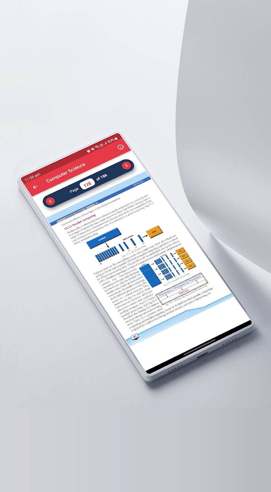

# Bookledge
### An application implemented using Flutter and Bloc pattern

BookLedge is a Flutter application which will let you download, save and read all your SCERT textbooks from class 1 to 12 and in 4 different Indian languages. 

Dashboard          |  Download        |  Reader
:-----------------:|:-------------------:|:-------------------:
</img>|</img>|</img>

  
### Play Store

  
